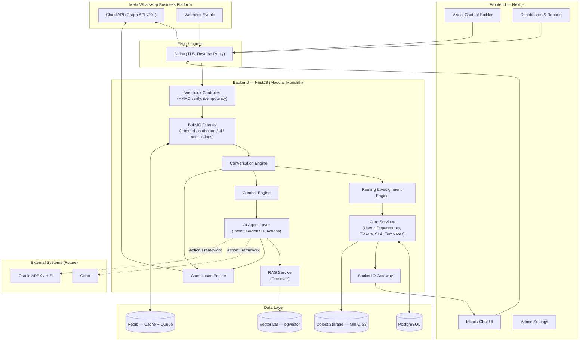
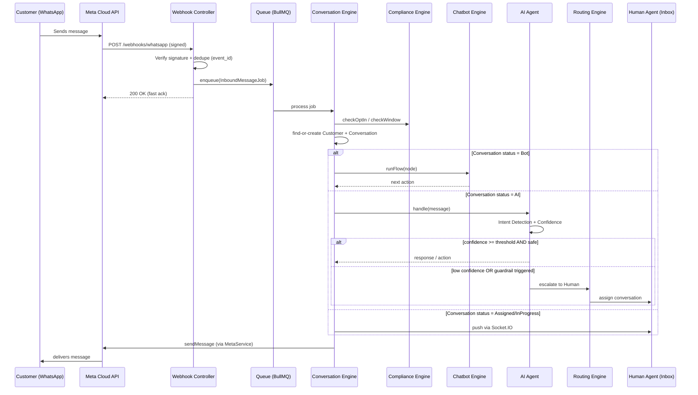

# المرحلة 1 — System Architecture

> منصة WhatsApp Customer Service & AI Agent — بنية معمارية للنظام الكامل (CRM + Chatbot Builder + AI Agent + RAG Knowledge Base)

## 1. نظرة عامة (Overview)

النظام عبارة عن منصة Customer Service متعددة الطبقات (Multi-Layer), مبنية حول **WhatsApp Business Platform / Meta Cloud API** الرسمي فقط. لا يوجد أي اعتماد على WhatsApp Web automation.

المكونات الرئيسية:

1. **Meta Cloud API** — القناة الوحيدة للتواصل مع WhatsApp (Inbound/Outbound).
2. **Webhook Ingestion Layer** — استقبال الأحداث من Meta بشكل آمن و idempotent.
3. **Message Queue (BullMQ/Redis)** — امتصاص الحمل، إعادة المحاولة، معالجة غير متزامنة.
4. **Conversation Engine** — إدارة دورة حياة المحادثة (state machine).
5. **Routing & Assignment Engine** — توزيع المحادثات على الأقسام/الموظفين.
6. **Chatbot Engine** — تنفيذ Flows مبنية بـ Visual Builder (node-based).
7. **AI Agent Layer** — Intent detection, RAG retrieval, guardrails, actions, handover.
8. **Knowledge Base / RAG** — Documents → Chunking → Embeddings → Vector DB → Retriever.
9. **Compliance Engine** — Opt-in/Opt-out, 24h window, template enforcement, rate limiting.
10. **Core CRM** — Customers, Tickets, SLA, Tags, Notes, Templates, Audit.
11. **Dashboard/Reports** — KPIs لكل من Admin/Department/Agent/AI.
12. **Multi-Tenant Layer** — `tenant_id` على مستوى كل الجداول ذات الصلة.

## 2. High-Level Architecture Diagram

## 3. Incoming Message Data Flow

## 4. Layering / Modular Monolith Principles

- **Controllers** لا تحتوي على Business Logic — فقط تفويض إلى Services.
- **Service Layer** لكل domain (`ConversationService`, `RoutingService`, `AIService`, ...) — راجع [10-folder-structure.md](10-folder-structure.md).
- **Repository access** عبر TypeORM Repositories/QueryBuilder، مع تغليف الاستعلامات المعقدة.
- **Meta API logic** معزول بالكامل داخل `MetaService`/`WhatsAppService` — لا يظهر مباشرة في أي مكان آخر (UI أو Controllers).
- **AI Actions** عبر Action Framework مع Whitelist صريح (راجع [06-ai-agent-architecture.md](06-ai-agent-architecture.md)).
- كل الاتصال الخارجي (Odoo/APEX/HIS) يمر عبر **Integration Layer** موحّد وليس مباشرة من AI أو Chatbot.

## 5. Cross-Cutting Concerns

| Concern | التنفيذ |
|---|---|
| Auth | JWT + Refresh Tokens + optional MFA (TOTP) |
| Authorization | RBAC (roles/permissions matrix) + tenant scoping |
| Validation | class-validator DTOs على كل Endpoint |
| Error Handling | Global Exception Filter موحّد + Structured error codes |
| Logging | Structured JSON logging (pino/winston) + correlation id لكل request/job |
| Idempotency | `webhook_events.event_id` unique constraint + Redis dedupe lock |
| Rate Limiting | Redis-based sliding window، على مستوى API وعلى مستوى الإرسال لكل رقم WhatsApp |
| Observability | Health checks لكل Dependency (Meta, DB, Redis, Queue, AI Provider) — راجع [09-deployment-architecture.md](09-deployment-architecture.md) |
| Multi-Tenancy | `tenant_id` + Postgres Row-Level Security (اختياري) أو تطبيق فلترة إلزامية على مستوى Repository base class |

## 6. المستندات المرتبطة بهذه المرحلة

1. [02-database-erd.md](02-database-erd.md) — ERD الكامل
2. [03-database-schema.sql](03-database-schema.sql) — DDL
3. [04-security-architecture.md](04-security-architecture.md)
4. [05-meta-integration-architecture.md](05-meta-integration-architecture.md)
5. [06-ai-agent-architecture.md](06-ai-agent-architecture.md)
6. [07-chatbot-architecture.md](07-chatbot-architecture.md)
7. [08-routing-architecture.md](08-routing-architecture.md)
8. [09-deployment-architecture.md](09-deployment-architecture.md)
9. [10-folder-structure.md](10-folder-structure.md)
10. [00-technology-stack.md](00-technology-stack.md)
