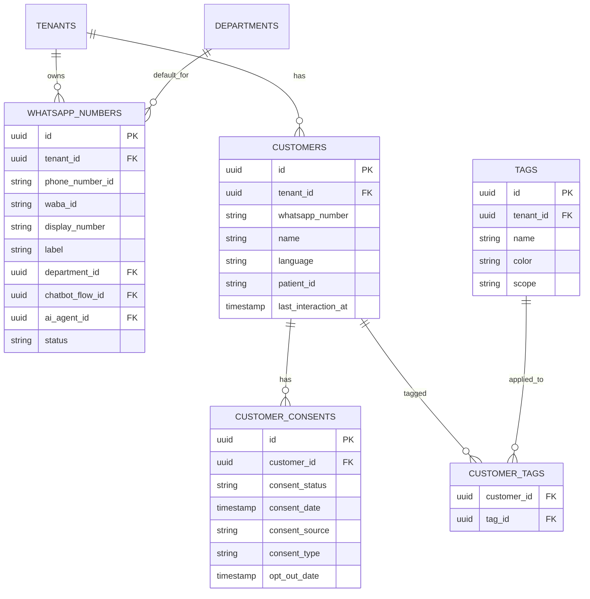
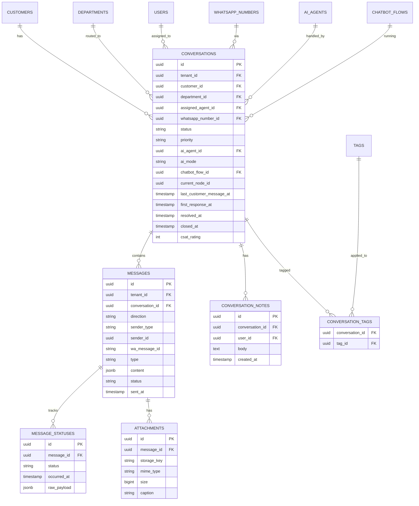
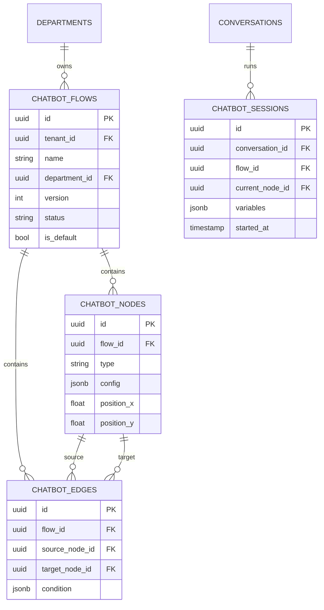
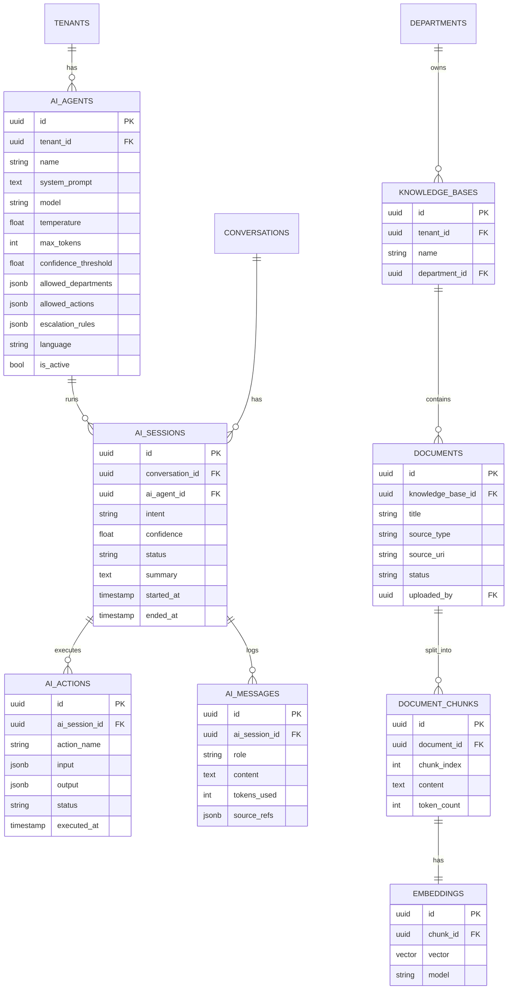
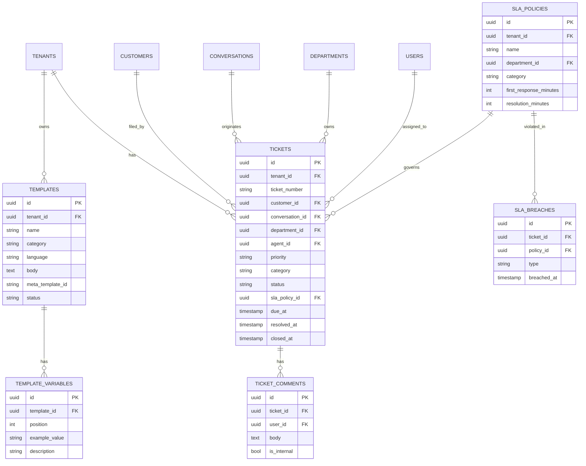
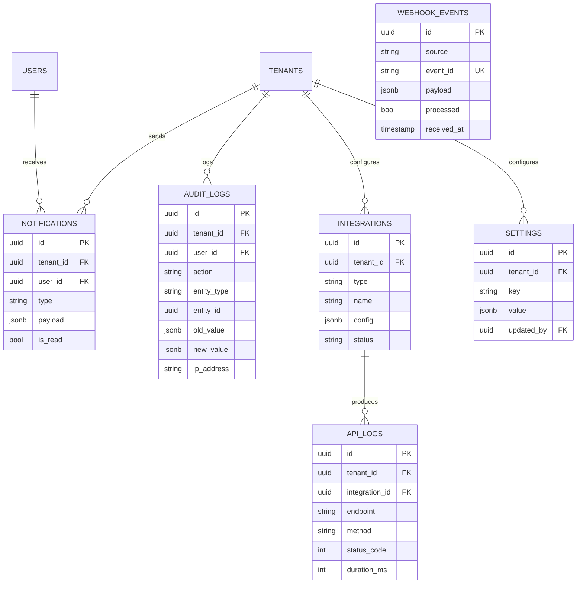

# Database ERD

كل الجداول (عدا `permissions`, `roles` النظامية) تحتوي على `tenant_id` لدعم [Multi-Tenant](#multi-tenancy). المخطط الكامل (DDL) موجود في [03-database-schema.sql](03-database-schema.sql).

## 1. Identity & Access

```mermaid
erDiagram
    TENANTS ||--o{ USERS : has
    TENANTS ||--o{ ROLES : scopes
    ROLES ||--o{ USERS : assigned_to
    ROLES ||--o{ ROLE_PERMISSIONS : has
    PERMISSIONS ||--o{ ROLE_PERMISSIONS : grants
    TENANTS ||--o{ DEPARTMENTS : has
    DEPARTMENTS ||--o{ DEPARTMENT_USERS : has
    USERS ||--o{ DEPARTMENT_USERS : belongs_to

    TENANTS {
        uuid id PK
        string name
        string slug
        string status
        string plan
    }
    ROLES {
        uuid id PK
        uuid tenant_id FK
        string name
        bool is_system
    }
    PERMISSIONS {
        uuid id PK
        string code
        string description
    }
    ROLE_PERMISSIONS {
        uuid role_id FK
        uuid permission_id FK
    }
    USERS {
        uuid id PK
        uuid tenant_id FK
        uuid role_id FK
        string name
        string email
        string password_hash
        string status
        bool mfa_enabled
        timestamp last_login_at
    }
    DEPARTMENTS {
        uuid id PK
        uuid tenant_id FK
        string name
        uuid supervisor_id FK
        jsonb working_hours
        uuid chatbot_flow_id FK
        uuid knowledge_base_id FK
        uuid ai_agent_id FK
        string ai_reply_mode
    }
    DEPARTMENT_USERS {
        uuid department_id FK
        uuid user_id FK
        bool is_supervisor
        jsonb skills
    }
```

## 2. WhatsApp Numbers, Customers & Consent

## 3. Conversations & Messages

## 4. Chatbot Builder

## 5. AI Agent & Knowledge Base (RAG)

## 6. Templates, Tickets & SLA

## 7. Notifications, Audit, Integrations & Settings

## Multi-Tenancy

كل جدول ذو صلة بالعميل يحتوي على عمود `tenant_id` (باستثناء `permissions` والجداول العالمية). القرار المعماري:

- **Row-level filtering إلزامي** في `BaseRepository` (Backend) — يُحقن `tenant_id` تلقائيًا من الـ Request Context في كل query.
- خيار **PostgreSQL Row-Level Security (RLS)** كطبقة حماية إضافية يمكن تفعيلها لاحقًا بدون تغيير الكود.
- `webhook_events` مستثناة من `tenant_id` مباشرة لأنها ترتبط بـ `phone_number_id` الذي يُحل إلى `tenant_id` عبر `whatsapp_numbers` أثناء المعالجة (الحدث الخام يصل قبل تحديد الـ tenant).
