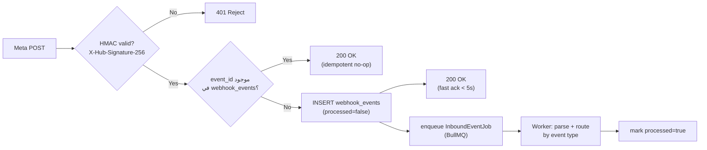
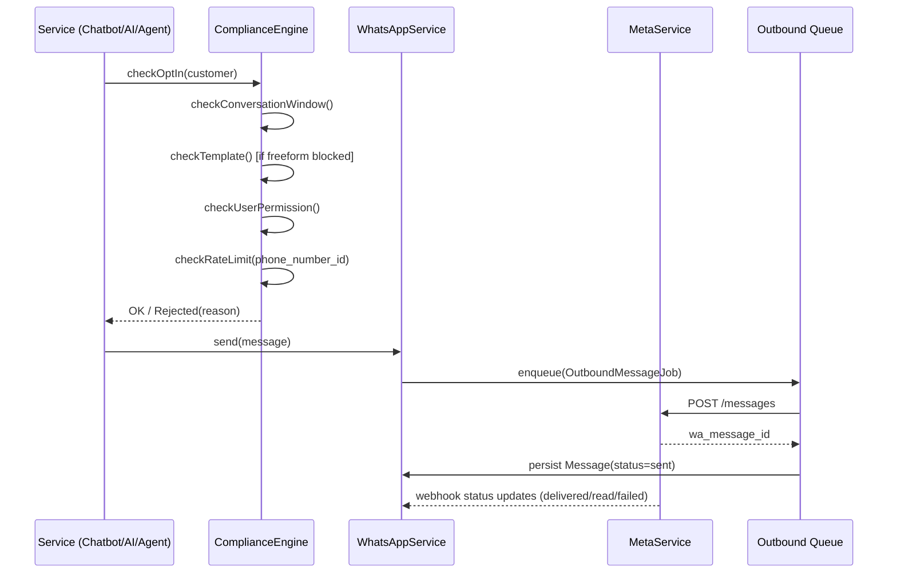

# Meta Integration Architecture

النظام يعتمد **حصريًا** على WhatsApp Business Platform / Meta Cloud API الرسمي. ممنوع تمامًا: WhatsApp Web automation، Puppeteer/Selenium WhatsApp، QR-based automation، unofficial APIs، أو message scraping — راجع [قسم 66 في المتطلبات الأصلية].

## 1. المكونات المطلوبة من Meta

| العنصر | أين يُستخدم |
|---|---|
| Meta Business Account | إدارة WABA |
| WhatsApp Business Account (WABA) | `whatsapp_numbers.waba_id` |
| Phone Number ID | `whatsapp_numbers.phone_number_id` |
| Access Token (System User Token) | مخزّن في Secret Manager، مرجع فقط في DB |
| Meta App ID / App Secret | التحقق من توقيع الـ Webhook |
| Verify Token | مصادقة Webhook subscription handshake |
| Message Templates | معتمدة عبر Meta Business Manager قبل الاستخدام |

## 2. MetaService — طبقة عزل كاملة

كل استدعاء لـ Graph API يمر حصريًا عبر `MetaService` (لا يوجد استدعاء مباشر لـ `graph.facebook.com` من أي مكان آخر في الكود):

```
MetaService
 ├── sendTextMessage()
 ├── sendTemplateMessage()
 ├── sendInteractiveMessage()   // buttons / list
 ├── sendMediaMessage()         // image/document/audio/video
 ├── markAsRead()
 ├── getMediaUrl()
 ├── downloadMedia()
 ├── getTemplateStatus()
 ├── registerPhoneNumber()      // onboarding new WA number
 └── refreshAccessToken()       // if using OAuth flow for embedded signup
```

`WhatsAppService` (Business Layer) يستدعي `MetaService` بعد المرور بـ [Compliance Engine](#5-compliance-checks-before-send) — لا Controller ولا UI يستدعي `MetaService` مباشرة.

## 3. Webhook Ingestion

**Endpoint:** `POST /webhooks/whatsapp` (HTTPS إلزامي)
**Verification:** `GET /webhooks/whatsapp` لـ handshake الأولي (`hub.verify_token`).

### Pipeline



### الأنواع المدعومة

- **Messages**: text, image, document, audio, video, location, contact, button reply, list reply, interactive.
- **Statuses**: sent, delivered, read, failed (مع `error.code`/`error.message` عند الفشل).

### Idempotency & Retry

- `webhook_events.event_id` (من `entry[].id` + `changes[].value.messages[].id` أو مكافئه) بقيد `UNIQUE`.
- Meta تُعيد المحاولة إن لم تستلم `200` خلال ثوانٍ معدودة → لهذا يجب أن يكون الـ Controller **سريعًا جدًا** (فقط تحقق + enqueue، بدون معالجة متزامنة).
- المعالجة الفعلية تتم داخل BullMQ worker مع `attempts: 5` و`backoff: exponential`.

## 4. Outbound Messaging Path



## 5. Compliance Checks Before Send

راجع [04-security-architecture.md](04-security-architecture.md) و[08-routing-architecture.md](08-routing-architecture.md). ملخص الفحوصات الإلزامية قبل أي `sendMessage`:

1. `checkOptIn()` — العميل لم يُسجّل Opt-out.
2. `checkConversationWindow()` — 24-Hour Customer Service Window: إن كانت منتهية وليست Template → رفض مع رسالة "Customer Service Window Expired" للموظف.
3. `checkTemplate()` — إن كانت الرسالة Template، يجب أن تكون `status = approved` في جدول `templates`.
4. `checkUserPermission()` — الموظف/الـ AI لديه صلاحية الإرسال لهذا القسم/المحادثة.
5. `checkRateLimit()` — لم يتجاوز حدود الإرسال (لكل رقم WhatsApp ولكل tenant).
6. `checkPolicyRules()` — لا يخالف قواعد Anti-Spam (Duplicate Message Detection خلال نافذة زمنية قصيرة).

فشل أي فحص → **لا يتم الإرسال**، ويُعاد سبب الرفض للموظف/الـ AI (وليس فشلًا صامتًا).

## 6. Message Status Tracking

كل `message_statuses` جديد يُحدّث `messages.status` (آخر حالة فقط) مع الاحتفاظ بالتاريخ الكامل. حالات الفشل (`failed`) تُطلق `Notification` من نوع `message_failed` للموظف المسؤول.

## 7. Multi-Number Support

جدول `whatsapp_numbers` يسمح بربط عدة أرقام WhatsApp بنفس الـ tenant، كل رقم مرتبط اختياريًا بـ:
- Department افتراضي
- Chatbot Flow افتراضي
- AI Agent افتراضي

عند استقبال Webhook، يُحدَّد الرقم المستقبِل (`metadata.phone_number_id`) لتحديد الـ tenant والإعدادات الافتراضية قبل إنشاء/تحديث المحادثة.

## 8. Media Handling

الوسائط الواردة (صور/مستندات/صوت) تُنزَّل عبر `MetaService.downloadMedia()` باستخدام `media_id` من الـ webhook، ثم تُرفع إلى MinIO/S3، ويُخزَّن `storage_key` في `attachments` — **لا تُخزَّن الوسائط الخام مباشرة في قاعدة البيانات**، ولا يُعاد استخدام رابط Meta المؤقت (ينتهي خلال دقائق) كمرجع دائم.
