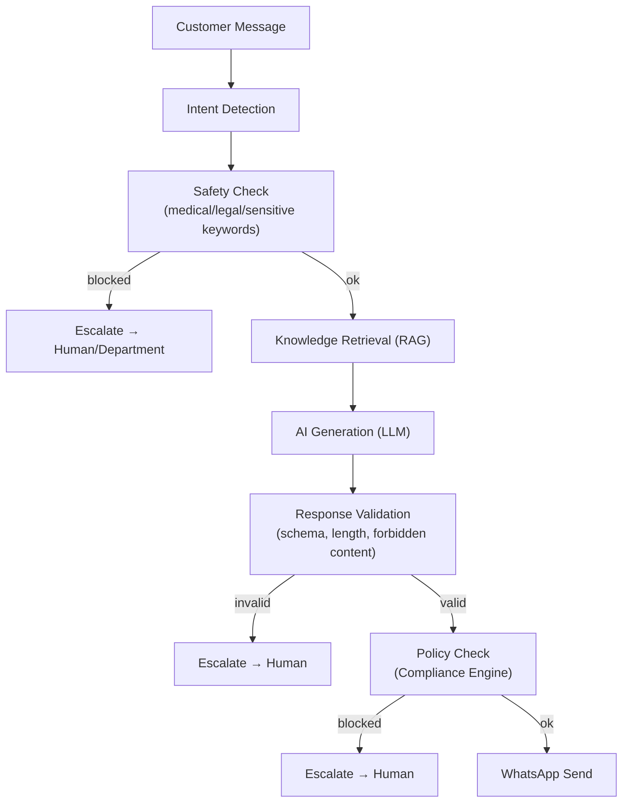
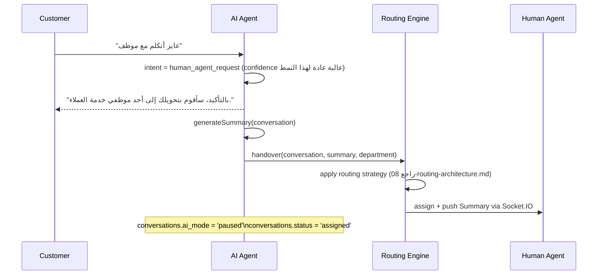
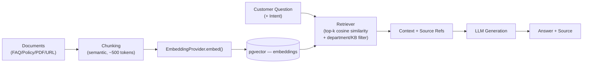

# AI Agent Architecture

## 1. مبدأ التصميم الأساسي: LLM Provider Abstraction

لا يوجد أي كود يعتمد مباشرة على SDK مزود معيّن. كل الوصول عبر interface:

```
interface LLMProvider {
  complete(params: { systemPrompt, messages, temperature, maxTokens, tools? }): Promise<LLMResponse>
}
interface EmbeddingProvider {
  embed(texts: string[]): Promise<number[][]>
}
```

`AIProviderAdapter` يختار التطبيق الفعلي (Anthropic/OpenAI/Azure/local model) بناءً على `AI_PROVIDER` env var. تبديل المزود = تغيير env var فقط، بدون إعادة بناء أي جزء من `AIService`/`ConversationService`.

## 2. Pipeline (Guardrail-First)



أي فشل في أي مرحلة → **Human Agent**، وليس محاولة "تخمين" رد بديل.

## 3. Intent Detection & Confidence

- كل رسالة عميل تُصنَّف إلى Intent واحد من قائمة مُعرّفة (Appointment Booking/Cancellation/Rescheduling, Price Inquiry, Location, Working Hours, Insurance, Laboratory, Radiology, Pharmacy, Complaint, Medical Inquiry, General Inquiry, Human Agent Request).
- كل قرار يحمل `confidence` (0-1).
- `ai_agents.confidence_threshold` (افتراضي 0.75): إن كانت `confidence < threshold` → **لا يتخذ AI قرارًا حساسًا**؛ يُحوَّل تلقائيًا لموظف بشري.
- يُسجَّل كل قرار في `ai_sessions.intent` + `ai_sessions.confidence` للـ Audit وللتحليلات ([قسم AI Analytics]).

## 4. Guardrails (غير قابلة للتجاوز برمجيًا، قابلة للتعديل من Admin)

قواعد ثابتة على مستوى الكود (لا تُعطَّل حتى من Admin):
- الـ AI **لا يقدّم تشخيصًا طبيًا**.
- الـ AI **لا يصف أدوية أو يُغيّر جرعات**.

قواعد قابلة للتخصيص (`ai_agents.guardrail_rules` JSONB، يُحررها Admin):
- كلمات مفتاحية/أنماط تُجبر التصعيد الفوري (مثل: ألم شديد، حساسية، طوارئ).
- عند اكتشاف مؤشر حالة طارئة محتملة: الرد الموجّه للعميل يحثّه على طلب الرعاية الطارئة المناسبة فورًا، بدل أي محاولة تشخيص، ثم تصعيد فوري لفريق Medical/Reception بأولوية `urgent`.

```json
// مثال ai_agents.guardrail_rules
{
  "forbidden_topics": ["medical_diagnosis", "drug_dosage", "prescription"],
  "force_escalation_keywords": ["ألم شديد", "نزيف", "لا أستطيع التنفس", "طوارئ"],
  "escalation_department": "medical_reception",
  "escalation_priority": "urgent"
}
```

## 5. AI Actions — Action Framework (Whitelisted فقط)

```
AllowedActions (مثال):
 ├── checkAppointment(patientId, date?)
 ├── getDoctorSchedule(doctorId)
 ├── getDepartment(name)
 ├── createTicket(customerId, category, description)
 ├── getPatientInfo(patientId)          // scoped بصلاحيات + PII minimization
 ├── createAppointmentRequest(payload)
 ├── sendTemplate(templateName, variables)
 ├── assignDepartment(conversationId, departmentId)
 └── assignAgent(conversationId, agentId)
```

قواعد صارمة:
- **لا SQL مباشر** وليس هناك أي مسار ينفّذ فيه الـ LLM استعلامات قاعدة بيانات حرة.
- كل Action لها **JSON Schema** صارم للمدخلات/المخرجات، يُتحقق منها قبل التنفيذ (لا "best effort parsing").
- Action غير موجودة في `ai_agents.allowed_actions` → تُرفض على مستوى `ActionExecutor` قبل أي محاولة تنفيذ، ويُسجَّل الرفض في `ai_actions.status = rejected`.
- كل الـ Actions التي تلامس أنظمة خارجية (Odoo/APEX/HIS) تمر عبر [Integration Layer](#6-integration-with-external-systems) الموحّد — لا استدعاء مباشر لأي API خارجي من داخل الـ LLM tool-call handler.

## 6. Integration with External Systems

`ActionExecutor` → `IntegrationService` → Adapter لكل نظام (`OdooAdapter`, `OracleApexAdapter`, `GenericHttpAdapter`) — راجع [01-system-architecture.md](01-system-architecture.md#4-layering--modular-monolith-principles). كل استدعاء يُسجَّل في `api_logs`.

## 7. Human Handover



**Conversation Summary** (مثال JSON مُولَّد من AI ويظهر للموظف):
```json
{
  "customer_name": "Ahmed",
  "intent": "Appointment Booking",
  "request": "Book appointment with Cardiology",
  "previous_actions": ["Asked about available doctors"],
  "status": "Waiting for agent"
}
```

## 8. AI Reply Modes (على مستوى Department)

| Mode | السلوك |
|---|---|
| `auto` | AI يرسل الرد تلقائيًا دون مراجعة بشرية |
| `suggestion` | AI يقترح ردًا (`suggested_replies`)، الموظف: Accept / Edit / Reject |
| `human_only` | تعطيل AI كليًا لهذا القسم |

## 9. Knowledge Base / RAG



- كل إجابة مبنية على RAG تحمل `source_refs` (مثال: `"FAQ – Radiology Department"` أو `"Knowledge Base – Insurance Policy"`)، تُخزَّن في `ai_messages.source_refs` للـ Audit والعرض الداخلي.
- الاسترجاع مُقيَّد بـ `knowledge_base_id` المرتبط بالـ Department (لا تسريب معلومات بين أقسام غير مرتبطة إلا إذا صُرِّح صراحة).
- `EmbeddingProvider` خلف interface — الانتقال من pgvector إلى Qdrant/Weaviate لاحقًا لا يغيّر `KnowledgeBaseService` أو `AIService`.

## 10. AI Observability

كل جلسة AI (`ai_sessions`) وكل رسالة (`ai_messages`) وكل Action (`ai_actions`) مُسجَّلة بالكامل → تغذّي [AI Dashboard](09-deployment-architecture.md) لاحقًا: AI Resolution Rate, Handover Rate, Confidence distribution, Token usage/cost, Most common intents.
