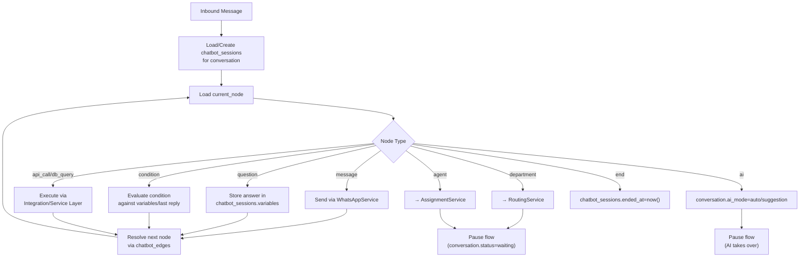

# Chatbot Architecture (Visual Builder)

## 1. مبدأ التصميم

Chatbot يُبنى بدون كود عبر Drag & Drop (React Flow في الـ Frontend)، ويُخزَّن كـ Graph: `chatbot_flows` → `chatbot_nodes` + `chatbot_edges`. التنفيذ الفعلي في الـ Backend عبر **Flow Execution Engine** يقرأ الـ Graph نفسه (لا "تفسير" مزدوج بين UI وBackend).

## 2. Node Types

| Node | الوظيفة | مثال `config` |
|---|---|---|
| `start` | نقطة البداية، مرتبطة بحدث (رسالة جديدة/كلمة مفتاحية) | `{ trigger: "any_message" }` |
| `message` | إرسال رسالة نصية/وسائط | `{ text: "مرحبًا بك..." }` |
| `question` | طرح سؤال وانتظار رد حر، يُخزَّن في `variables` | `{ variable: "patient_name", validation: "text" }` |
| `button` | رسالة بأزرار (حتى 3) | `{ text: "...", buttons: [{id,title}] }` |
| `list` | رسالة List Message (حتى 10 عناصر) | `{ text: "...", sections: [...] }` |
| `condition` | تفريع بناءً على متغير/رد سابق | `{ variable: "choice", cases: {"1":"node_a","6":"node_b"} }` |
| `department` | تحويل المحادثة لقسم | `{ department_id: "..." }` |
| `agent` | تحويل مباشر لموظف محدد أو للـ Routing Engine | `{ mode: "routing" \| "specific", agent_id? }` |
| `ai` | تسليم المحادثة للـ AI Agent | `{ ai_agent_id: "..." }` |
| `api_call` | استدعاء API خارجي عبر Integration Layer | `{ integration_id, endpoint, method, mapping }` |
| `db_query` | استعلام محدد مسبقًا (ليس SQL حر) عبر Service مُعرَّف | `{ query_name: "checkAppointment", params_mapping }` |
| `delay` | تأخير قبل الخطوة التالية | `{ seconds: 5 }` |
| `tag` | إضافة Tag تلقائي للمحادثة/العميل | `{ tag_id: "..." }` |
| `end` | إنهاء الـ Flow (لا يُغلق المحادثة بالضرورة) | `{}` |

## 3. Execution Engine



- الـ Engine **Idempotent** لكل خطوة: إن وصلت رسالة مكررة (retry من Meta) لا يُعاد تنفيذ نفس الخطوة مرتين (تحقق عبر `wa_message_id` المُعالج مسبقًا في `messages`).
- `chatbot_sessions.variables` (JSONB) هي الذاكرة المؤقتة للـ Flow — تُستخدم في `api_call`/`condition`/التلخيص عند التحويل للـ AI أو الموظف.

## 4. مثال Flow (خدمة عيادة)

```
Start (trigger: any_message)
  → Message: "مرحبًا بك في مركزنا. كيف يمكننا مساعدتك؟"
  → List: [1 حجز موعد, 2 تعديل موعد, 3 إلغاء موعد, 4 الاستفسار عن الخدمات,
           5 الأسعار, 6 التأمين, 7 الشكاوى, 8 التحدث مع موظف]
  → Condition (على الرد):
       "1" → Question("اسم المريض") → Question("رقم الملف")
            → API Call(checkAppointment) → Message(نتيجة) → End
       "6" → Department(insurance)
       "7" → Tag(complaint) → Department(complaints)
       "8" → Agent(routing)
```

## 5. Versioning & Publishing

- `chatbot_flows.status`: `draft` → `published` → `archived`.
- تعديل Flow منشور لا يؤثر على جلسات محادثة جارية بنفس الإصدار (كل `chatbot_sessions.flow_id` يُثبَّت عند بداية الجلسة)؛ تعديلات تُطبَّق فقط على محادثات جديدة بعد `publish`.
- `is_default` يحدد الـ Flow الافتراضي لكل Department/WhatsApp Number.

## 6. العلاقة مع الـ AI

عقدة `ai` تُنهي تنفيذ الـ Chatbot Graph وتُسلّم المحادثة لـ [AI Agent Layer](06-ai-agent-architecture.md) — الـ Chatbot والـ AI **لا يعملان بالتوازي على نفس الرسالة**؛ إما Bot أو AI أو Human في أي لحظة معينة (`conversations.status` هو مصدر الحقيقة الوحيد لمن يملك زمام المحادثة حاليًا).
