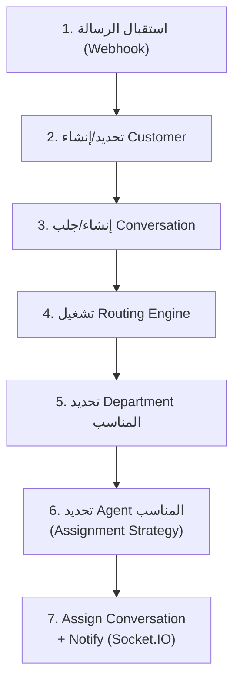
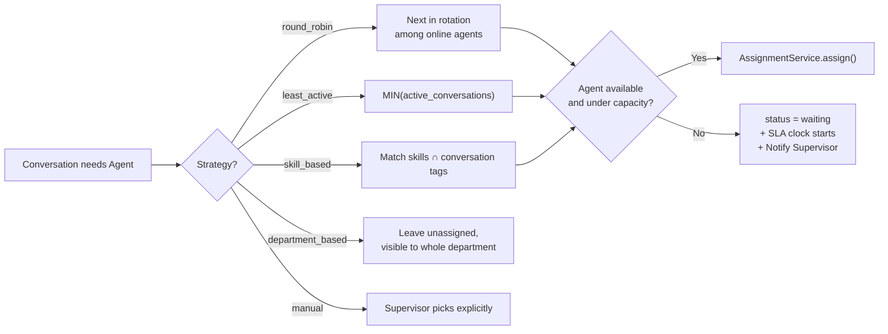
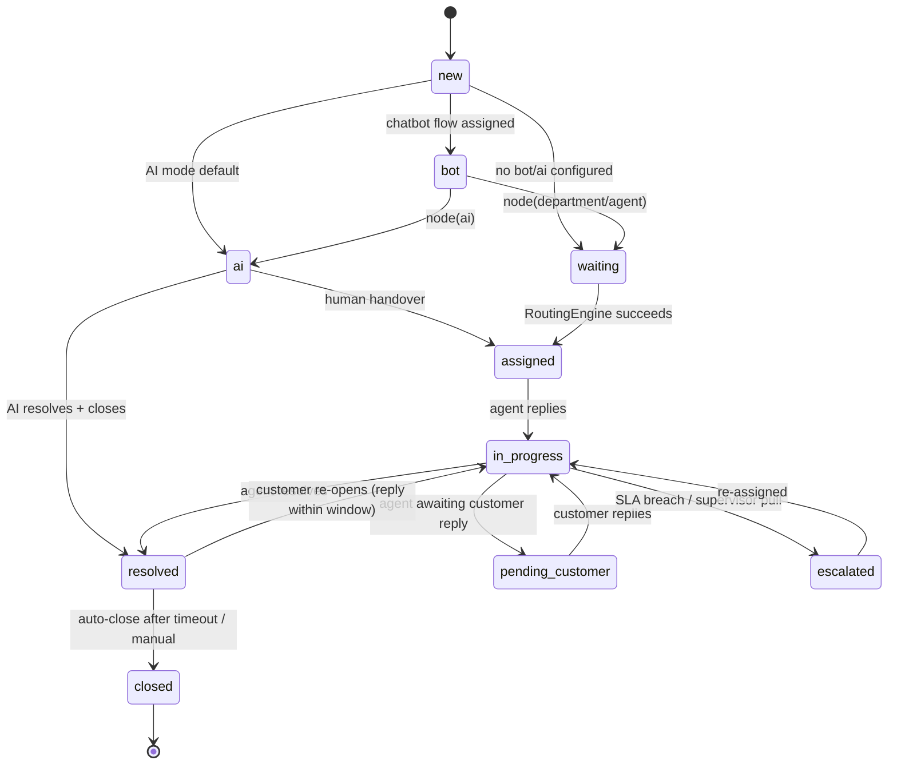

# Conversation Routing & Assignment Architecture

## 1. تسلسل معالجة الرسالة الجديدة

الخطوة 4 (تحديد Department) تُقرَّر عبر: WhatsApp Number الافتراضي ← أو Chatbot Flow (عقدة `department`) ← أو AI Intent Classification ← أو Manual (Supervisor).

## 2. RoutingService — استراتيجيات التوزيع

| الاستراتيجية | المنطق |
|---|---|
| **Round Robin** | توزيع متساوٍ دوري بين موظفي القسم النشطين (مؤشر `last_assigned_index` لكل قسم) |
| **Least Active** | الموظف صاحب أقل عدد محادثات بحالة `assigned`/`in_progress` حاليًا (`COUNT` مقيّد بـ `department_users.max_concurrent_conversations`) |
| **Skill Based** | مطابقة `department_users.skills` مع Tag/Intent المحادثة (مثال: مطابقة "insurance") |
| **Department Based** | التوزيع فقط حسب القسم دون تحديد موظف بعينه (يبقى في `waiting` لحين اختيار يدوي أو Round Robin كخطوة ثانية) |
| **Manual Assignment** | Supervisor يختار الموظف يدويًا من الـ Inbox — يتجاوز أي استراتيجية آلية |

الاستراتيجية الافتراضية قابلة للتهيئة **لكل قسم** (`departments` settings)، مع إمكانية Fallback: إن فشلت (كل الموظفين offline/at capacity) → تبقى المحادثة `waiting` وتُطلق `Notification` من نوع `customer_waiting` للـ Supervisor.

## 3. AssignmentService

- `assign(conversationId, agentId)`:
  1. يتحقق أن الموظف عضو في `department_users` للقسم المعني.
  2. يتحقق من عدم تجاوز `max_concurrent_conversations`.
  3. يُحدّث `conversations.assigned_agent_id`, `status = assigned`.
  4. يُنشئ `conversation_participants` (owner).
  5. يُطلق `Notification(new_assignment)` + Socket.IO push فوري للـ Inbox.
  6. يُسجّل `audit_logs`.
- **Transfer**: نفس المسار لكن مع تسجيل `audit_logs.action = conversation_transferred` + سبب اختياري.

## 4. Conversation State Machine

الانتقالات كلها عبر `ConversationService.transition(conversationId, newStatus, actor)` — لا تحديث مباشر لعمود `status` من أي مكان آخر، لضمان تسجيل `audit_logs` والتحقق من صحة الانتقال (لا يمكن القفز من `new` إلى `closed` مباشرة مثلًا).

## 5. Priority & SLA Interaction

- `priority` (`low|normal|high|urgent`) تُحدَّد يدويًا أو تلقائيًا (مثال: AI guardrail يرفع الأولوية لـ `urgent` عند مؤشرات طارئة، أو `complaint` tag يرفعها لـ `high`).
- عند `assigned`، تُربط المحادثة بـ `sla_policies` مناسبة (حسب Department/Category) لحساب `due_at` لأول رد وللحل — راجع [03-database-schema.sql](03-database-schema.sql#L7-tickets--sla).
- تجاوز الـ SLA → `sla_breaches` + `Notification(sla_breach)` للـ Supervisor.

## 6. Working Hours

كل Department له `working_hours` (JSONB). خارج أوقات العمل: الرسائل الواردة تُستقبل عاديًا وتدخل `waiting`، لكن الـ Routing Engine لا "يُشغّل" تنبيه فوري لموظف (بدلًا من ذلك رسالة تلقائية "خارج أوقات العمل" + تسجيل انتظار لأول موظف متاح عند الفتح).
